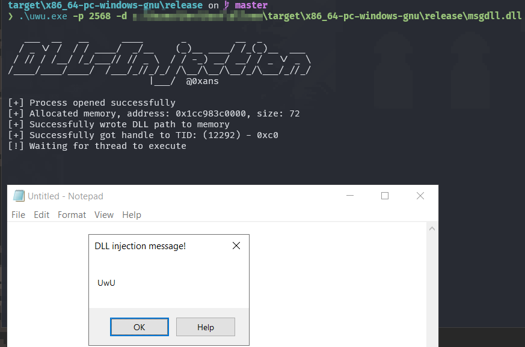

# Rust DLL Injector


## Author: 0xans

## Contact: Instagram: [0x.ans](https://instagram.com/0x.ans)

```
   ___  __   __      ____       _         __  _         
  / _ \/ /  / / ____/  _/__    (_)__ ____/ /_(_)__  ___ 
 / // / /__/ /_/___// // _ \  / / -_) __/ __/ / _ \/ _ \
/____/____/____/  /___/_//_/_/ /\__/\__/\__/_/\___/_//_/
                          |___/  @0xans        
```

## Description

This Rust tool is designed for injecting DLLs into processes on Windows. It includes an example project for creating a DLL that pops up a MessageBox, which can then be injected into any target process.

## Requirements

- Rust (stable toolchain)
- Windows environment
- `cargo` package manager

## Installation

1. Clone the repository:
   ```bash
   git clone https://github.com/0xans/DLLinjection.git
   ```
2. Go to the project directory:
   ```bash
   cd DLLinjection
   ```
   
3. **Creating the DLL:**
   There is a tool included in this project to help you create the DLL using the `messagebox.rs` example provided. This example generates a simple DLL that triggers a MessageBox in the target process.

   To build the DLL:
   ```bash
   cargo build --release --target x86_64-pc-windows-gnu
   ```
   The resulting DLL file (`messagebox.dll`) will be in the `target/release/` directory.

4. **Building the injector:**
   Go to the injector directory and build the injector tool:
   ```bash
   cd injector
   cargo build --release --target x86_64-pc-windows-gnu
   ```

## Usage

Run the injector by specifying the target process and the path to the DLL file:

```bash
./injector.exe -p <PID> -d <dll_file>
```

### Options:

- `-p`, `--pid`: The target PID for injection.
- `-d`, `--dll`: The path to the DLL file (must be a compiled Windows DLL).

## Example

To inject a DLL into a target process with PID `5678`:

```bash
./injector.exe -p 5678 -d ./target/release/messagebox.dll
```

## Issues?

For any questions or issues, feel free to reach out on Instagram: [0x.ans](https://instagram.com/0x.ans).
